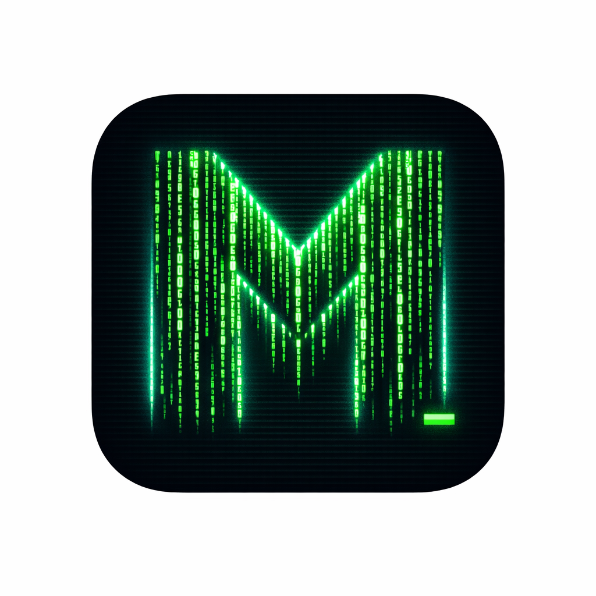

# Mobilecode-open

<p align="center"></p>

> An open-source iOS companion app for [opencode](https://opencode.ai) — pilot a remote
> `opencode serve` instance from your iPhone with a live, continuous-link feel.


Mobilecode-open is a **self-hosted, fully auditable** iOS client for opencode. Your code, your
credentials, and your conversations never leave your own `opencode serve` instance — there is no
third-party backend. It is a derivative work of
[`giuliastro/opencode-remote-android`](https://github.com/giuliastro/opencode-remote-android)
(Apache-2.0), adapted to iOS and extended well beyond the original.

## Why

- **Open & auditable.** Every line is public (Apache-2.0). A coding agent reads your source, your
  API keys, and your filesystem — you should be able to read every line of the app that does it.
- **Self-hosted.** Talks directly to your own `opencode serve` over your own network (Tailscale
  Serve recommended). No middleman, no telemetry.
- **Yours to shape.** Two built-in skins, toggleable Matrix FX, a home widget + Live Activity, and
  a macOS menu-bar controller — all hackable.

## Features

- **Sessions** — list / detail / prompt / slash-commands / abort, with concurrent sessions across
  multiple project directories.
- **Full opencode surface** — permission prompts (Once / Always / Reject), fork, share/unshare,
  revert, summarize, rename, delete, shell, file read & search, providers & models picker,
  MCP/LSP/formatter diagnostics, config read.
- **Live updates** — adaptive polling (1 s busy / 5 s idle / 20 s background) backed by an SSE
  liveness stream. Local notifications, haptic feedback and sound on completion.
- **Rich rendering** — tool / reasoning / file parts, file attach from a built-in browser, and
  clear "who-says-what" role coding (no emojis — crisp SVG icons throughout).
- **Two skins** — _Matrix_ (phosphor-green hacker console, default, with optional scanlines,
  digital rain, and a katakana→text decode animation) and _OpenCode_ (clean warm-neutral + gold
  accent, no FX).
- **iOS integrations** — home-screen Widget, Live Activity + Dynamic Island driven by session
  busy/idle states.
- **OpenCodeBar** — an optional native macOS menu-bar utility to start/stop `opencode serve`
  (one-click ON/OFF, Keychain password, login item, auto-restart).
- **Shell console** — run one-shot commands in a session's directory (`POST /session/:id/shell`),
  Matrix-styled. (Request/response, not an interactive PTY.)
- **Voice input** — on-device speech-to-text (iOS `SFSpeechRecognizer`) right in the composer.
- **Push notifications** — get notified when a session finishes even with the app closed, via a
  self-hosted APNs relay + the OpenCodeBar watcher. **opencode credentials stay on your Mac** —
  the public relay only ever holds the APNs key + device tokens. See
  [`docs/push.md`](docs/push.md).

## Requirements

- [`opencode`](https://opencode.ai) running somewhere reachable.
- iOS 17+ device or simulator; Xcode 16+/26 to build.
- (Recommended) [Tailscale](https://tailscale.com) for zero-friction HTTPS from the phone.

## Quick start

```bash
git clone https://github.com/elkir0/Mobilecode-open
cd Mobilecode-open
npm install          # install web dependencies
npm run build:ios    # build web + cap sync ios  ← run before every Xcode ⌘R
npm run open:ios     # open Xcode
```

In Xcode: set your signing team, pick a device or simulator, then ⌘R.

> Fast web-only iteration (no iOS rebuild): `npm run dev`. A deterministic fake server for local
> testing: `npm run mock`.

## Pointing it at opencode serve

Start opencode with the concrete CORS origins the webview needs (note: `*` does not work — the
proxy must emit explicit `Access-Control-Allow-Origin`):

```bash
OPENCODE_SERVER_PASSWORD=<your-password> \
opencode serve --hostname 0.0.0.0 --port 4096 \
  --cors capacitor://localhost --cors https://localhost
```

For zero-friction HTTPS from the phone (recommended — plain HTTP is blocked by iOS ATS even with
`NSAllowsArbitraryLoads`), expose it over Tailscale Serve:

```bash
tailscale serve --bg --https 443 http://localhost:4096
```

Then in the app: connect to `https://<machine>.<tailnet>.ts.net`, port `443`, Basic Auth.

See [`docs/testing.md`](docs/testing.md) for the full manual checklist, and [`menubar/`](menubar/)
for the one-click macOS controller.

## Architecture

```
iPhone (Capacitor webview)              opencode serve (your machine / Tailscale)
┌──────────────────────────────┐        ┌─────────────────────────┐
│ React UI (App.tsx)           │        │ REST /session/* /event  │
│  ├ api.ts   (REST, CapacitorHttp) ◄───┤ Basic Auth + HTTPS      │
│  ├ store.ts (state machine)  │  SSE   │ Tailscale Serve :443    │
│  ├ sse.ts   (fetch-stream)   │ ◄─────►│ → proxy http://:4096    │
│  └ plugins/ (TS + Swift)     │        └─────────────────────────┘
└──────────────────────────────┘
Widget Extension: home widget + Live Activity (reads an App Group snapshot)
```

- **`web/src/api.ts`** — REST client (~50 endpoints), the single source of truth.
- **`web/src/store.ts`** — connection state machine + adaptive polling + busy/idle tracking.
- **`web/src/sse.ts`** — SSE via fetch-streaming in the webview.
- **`web/src/App.tsx`** — the entire UI.
- **`web/src/styles.css`** — the two-skin design system (Matrix + OpenCode).
- **`ios/`** — Capacitor iOS target, native plugins (OpenCodeSSE, SharedSnapshot, LiveActivity),
  and the Widget extension.
- **`menubar/`** — OpenCodeBar, the macOS menu-bar controller.

## Skins

| Skin | Look | FX |
|---|---|---|
| **Matrix** (default) | Phosphor-green hacker console | scanlines + glow, digital rain, katakana→text decode (all toggleable) |
| **OpenCode** | Warm-neutral + gold accent, editorial | none — clean |

Switch in **Settings → Appearance style**. Both skins share the exact same component shapes and
layout; only color tokens and FX differ.

## Scripts (run from the repo root)

| Command | What it does |
|---|---|
| `npm run build:ios` | build web + `cap sync ios` (run before every ⌘R) |
| `npm run dev` | vite dev server (browser, fast iteration) |
| `npm run mock` | fake opencode server on `:4096` |
| `npm run check` | `tsc` + core tests |
| `npm run test` | all web tests |
| `npm run open:ios` | open the project in Xcode |

## Roadmap

- **Security & robustness** — multi-server profiles, Keychain credentials, biometric unlock,
  self-signed certificate acceptance.
- **CI / TestFlight** — GitHub Actions macOS runner + fastlane, on tag `v*`.
- **App Intents / Shortcuts**, **Share Extension**.
- **True SSE streaming** — pending a solution to the Tailscale proxy's SSE buffering.

## Credits & license

Apache-2.0. This project is a derivative of
[`giuliastro/opencode-remote-android`](https://github.com/giuliastro/opencode-remote-android)
(Apache-2.0); see [`ATTRIBUTION.md`](ATTRIBUTION.md), [`LICENSE`](LICENSE), and
[`LICENSE-ORIGINAL`](LICENSE-ORIGINAL). [opencode](https://opencode.ai) is © its authors.
**Mobilecode-open** is an independent project and is not affiliated with or endorsed by the
opencode project.
